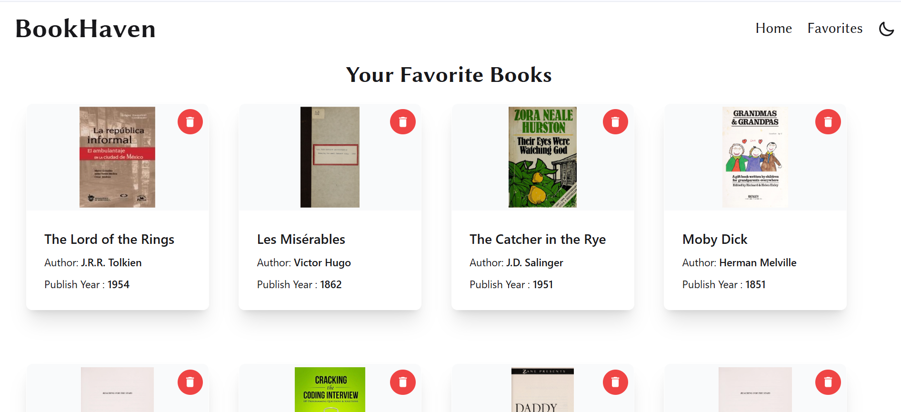
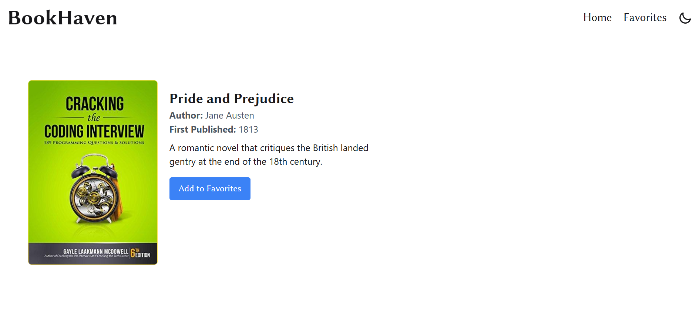
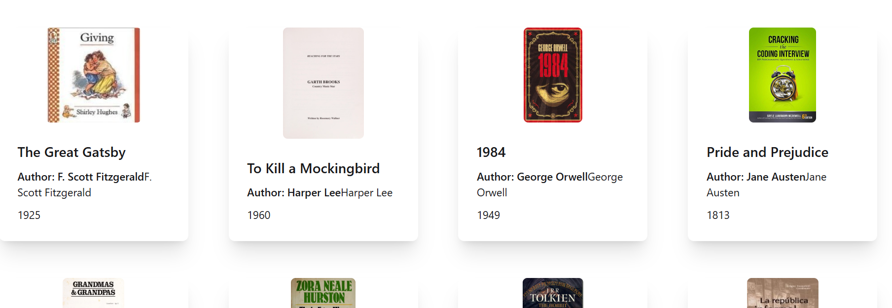

# BookHaven

A simple React app to browse and manage a list of books using a public API.  
This project is part of my frontend learning where I implemented search, details, favorites, and a clean responsive UI.

---

## Features

- **Search Books**: Search books by title/author using the API.
- **Responsive Book Grid**: Each book card shows **cover, title, author, publish year**.
- **Book Details Page**: On clicking a book → navigate to details page with full info.
- **Favorites Page**: Add/Remove books from favorites (saved in **localStorage**).
- **Dark/Light Mode**: Toggle theme (bonus feature).
- **Pagination**: Browse books page-wise with smooth navigation.
- **Loading & Error States**: Proper loader and error messages.

---

## Tech Stack

- **React (Vite)**
- **Tailwind CSS + DaisyUI** for styling
- **React Router DOM** for routing
- **LocalStorage** for favorites persistence
- **React Icons** for icons

---

## API Endpoint

All book data is fetched from the JSON placeholder API: https://my-json-server.typicode.com/pranayBaynineventures/assignment-get_all_books/books

---

## Screenshots

### Home Page

### Favorites Page

### Book Details Page

### Books Page

---

## Author 👨‍💻

**CodeWithAmar**

- [Portfolio](https://amarfolio.vercel.app)
- [GitHub](https://github.com/Amar-6003)
- [LinkedIn](https://www.linkedin.com/in/amar6003)

---

## Getting Started

Clone repo:

- git clone https://github.com/Amar-6003/BookHaven.git
- cd BookHaven
- npm install
- npm run dev
